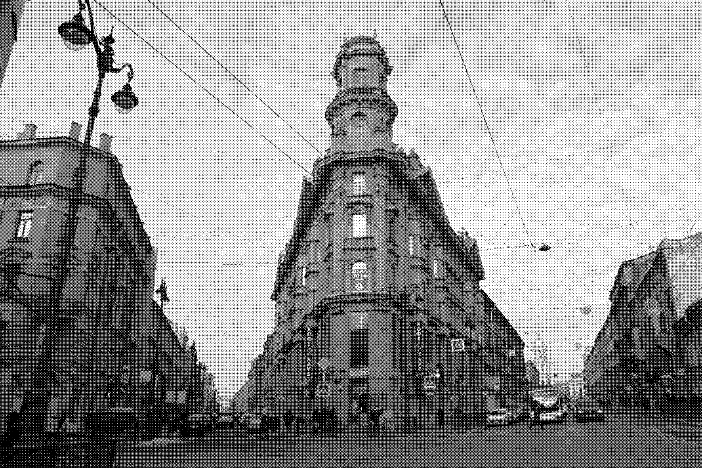

# Бинаризация с адаптивным порогом

## Теория

Бинаризация -  преобразование, заключающееся в превращении изображения в
двухцветное черно-белое. Главным параметром такого преобразования является порог
– значение, которое будет критерием проверки интенсивности точки изображения.

Порог в бинаризации может быть как константой, так и являться функцией,
определенной на всем изображении (глобальная) или на некоторой области
(локальная).

Бинаризация Отсу - тип глобальной бинаризации, который основан на максимизации
межклассовой дисперсии.

Для нахождения порога k необходимо найти максимум функции:


После нахождения порога изображение бинаризируется.

## Разработанные приложения

В ходе работы были разработаны три приложения. Два из них написаны на python с
использованием библиотеки opencv и без. Третье приложение написано на языке C++ с
испльзованием библиотеки CImg, используемой для удобного открытия и последующей
работы с изображением. Каждое приложение имеет следующий интерфейс для работы из
командной строки.

Флаг `-g` активирует графический пользовательский интерфейс, позволяющий
просматривать изображение до бинаризации и после. Смена производится нажатием
клавиши n. Аргумент `-o` указывает путь по которому будет сохранено
бинаризированное изображение. 

## Результаты работы

### Полученные изображения

Python с использованием opencv


C++


Python


### Сравнение изображений

Для сравнения изображений используется утилита `compare` из набора
`imagemagick`. В качестве эталона берется изображения полученное с
использованием opencv. 

```
compare -compose src pyopencv.jpg cppnative.jpg cv_vs_cpp.png
compare -compose src pyopencv.jpg pynative.jpg cv_vs_py.png 
```
Полученные изображения:

Разница с реализаций на С++


Разница с реализаций на Python без opencv


### Время работы

Измеряется среднее процессорное время (пользовательское + системное) за 100
выполнений.

```
./test.zsh "python3 python/opencv.py img/grayscale.jpg"
0.0042743797900000038
```

```
./test.zsh "python3 python/native.py img/grayscale.jpg"
5.45225538571
```

```
./test.zsh "cpp/binary_noopt img/grayscale.jpg"
0.056086810000000022
```
Быстрее всего операция бинаризации выполняется в приложении, использующем
библиотеку opencv.

### Обьяснение разницы во времени выполнения

Рассматривается файл `modules/imgproc/src/thresh.cpp`. Сразу виден намек на
использование специальных инструкций (на практике скорее всего используются
SSE):

```cpp
#if CV_SIMD
...
```

Помимо использования специальных инструкций,
предположительно, применяется паралеллльная обработка данных:

```cpp
parallel_for_(Range(0, dst.rows), 
	ThresholdRunner(src, dst, thresh, maxval,type),
	dst.total()/(double)(1<<16));
```

С целью уменьшить время обработки изображения, приложение на С++ собирается с
флагом -O3. Открывем бинарник в radare2 и видим, что в дизассемблированной
функции появляются те самые SIMD инструкции (компилятор использовал MMX
instruction set). 

``` 
...
0x000144cc      660f68f5       punpckhbw xmm6, xmm5
0x000144d0      660f60c5       punpcklbw xmm0, xmm5
0x000144d4      660f6fce       movdqa xmm1, xmm6 
0x000144d8      660f69f4       punpckhwd xmm6, xmm4 
... 
```

После компиляции с оптимизацией, время выполнения операции бинаризации
уменьшилось с 50 до 20 мс, что хоть и довольно неплохо, но все равно в 5 раз
дольше чем в реализации opencv. Нагнать opencv можно как раз за счет внедрения
многопоточной обработки.

```
./test.zsh "cpp/binary img/grayscale.jpg"
0.019009589999999996
```

## Вывод

В ходе работы было написано 3 программы, выполняющие бинаризацию изображения на
входе. По результатам тестирования быстрее всего данную операцию выполняет
программа написанная на Python с использованием библиотеки opencv. Такая
скорость достигается за счет использования специальных инструкций процесора и
применения метода многопоточной обработки. На втором место по скорости
выполнения распологается программа написанная на C++. С применением оптимизации
во время компиляции удалось сократить время выполнения более чем вдвое.


## Источники

Цифровая обработка изображений [2012] Гонсалес, Вудс

## Bonus 1 Когда речь заходит о бинаризации, хочется упомянуть о дизеринге.
Есть множество способов составить карту. Я выбрал способ с использованием матриц
Байера. Да, в фотоаппаратах тоже используется разработанные Байером матрицы. Для
реализации небоходимо сначала сгенерировать матрицу нужного размера.
Продублировать матрицу, чтобы ее размер совпал с размером изображения. Значение
в каждой ячейки матрицы и есть порог для бинаризации.

В итоге получется изображение только из черных и белых цветов. Такое изображение
можно сжать, отправить, разжать и размыть. В итоге можно получить близкое по
качеству черно-белое изображение в полутонах. Может даже в этом есть практическая
польза, но стоит отметить, что такие изображения хуже сжимаются по сравнению с
полученными после бинаризации.



[Статья на хабре про дизеринг](https://habr.com/ru/company/wunderfund/blog/680154/)

[Генерация матриц Байера](https://en.wikipedia.org/wiki/Ordered_dithering#Pre-calculated_threshold_maps)

## Bonus 2

В ходе выяснения различий по скорости работы различных приложений я в начале
захотел взглянуть на дизассемблированную функцию threshold, чтобы убедиться в
наличии SIMD инструкций. Но разделяемые библиотеки в pip собраны без отладочных
символов и отдельно я их не нашел. Но наткнутлся на очень интересный факт.
Opencv использует какую-то из библиотек фортрана )))


