# Алгоритмы поиска иображений

## Template matching или прямой поиск

Этот алгоритм поиска основан на попиксельном сравнении. Шаблон "накладываеься"
на исходное изображение и высчитывается некоторая метрика, показывающая как
сильно отличаются пиксели одного изображения от другого. В качестве метрики
может использоваться корреляционная или квадратичная функция.

Плюсом алгоритма является простота реализации. К минусам можно отнести то, что
алгоритм сильно чувствителен к масштабированию и поворотам.

## ORB

Алгоритм является более сложным. Перед выполнением поиска, сначала на
изображениях определяются опорные точки. Делается это следующим образом. На
изображении выбирается пиксель. В радиусе 3 выбирается 16 пикселей.
Пиксели разбиваются на 3 категории: те, что ярче центра, такие же и те, что
темнее. Если более 8 пикселей темнее или светлее центра, то точка выбирается,
как опорная. 

Исходные изображение сжимается в 2, 4 и 8 раз. И операция поиска опорных точек
продолжается. Таким образом достигается независимоть от масштаба.

Далее для каждой точки вычисляется ориентация

После вычисляется BRIEF дескриптор. Это длеается путем случайной выборки
пикселей из некоторой окресности якорной точки. Для того, чтобы предотвратить
влияние высокочастотчных шумов, изображение пред этим размывается в
использованием размытия Гаусса.

Далее BRIEF дескриптор сдвигается в зависимости от угла ориентации опорной точки
таким образом минимизируется влияние разности ориентации обьекта на шаблоне и
исходном сообщении.

## Тестирование и сравнение алгоритмов

Для тестирования алгоритма берется одно исходное изображение, из которого
вырезаются шаблоны под углом и без. Шаблоны, вырезанные без поворота
масштабируются. Далее производится поиск полученных шаблонов на исходном
изображении. Для генерации изобржаений используется скрипт `generate.sh`.

  
  
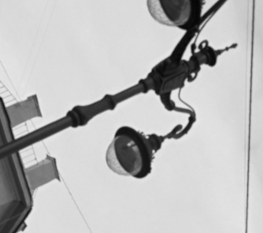  
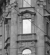 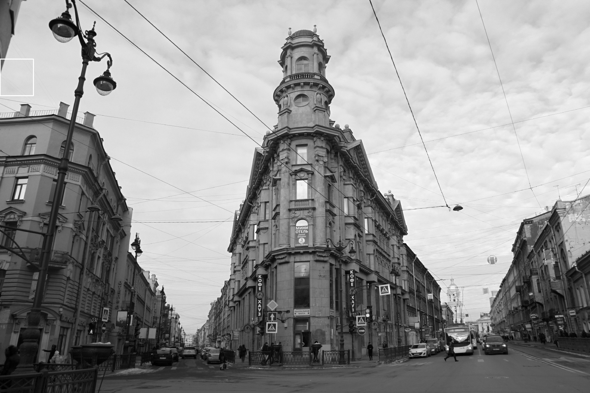 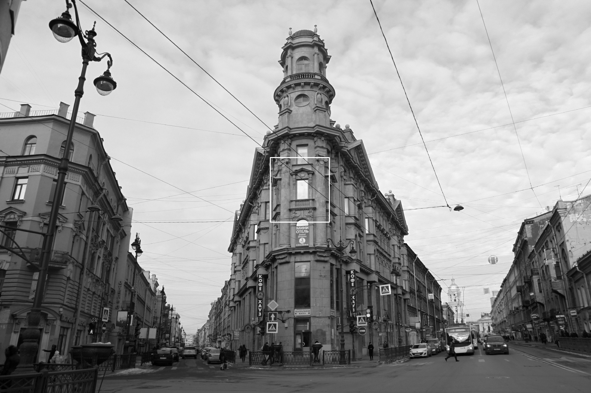
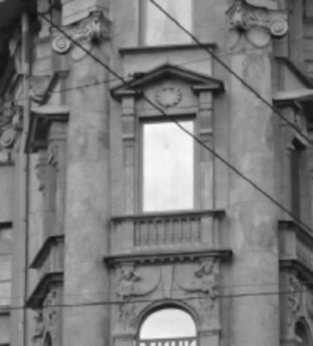  

  
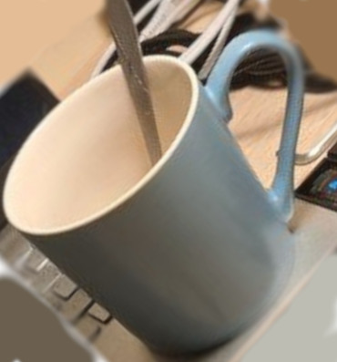  
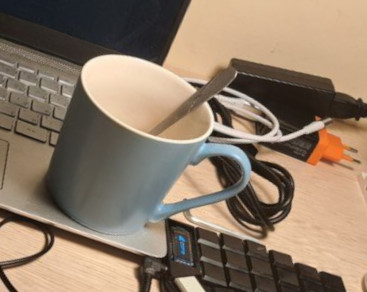  
  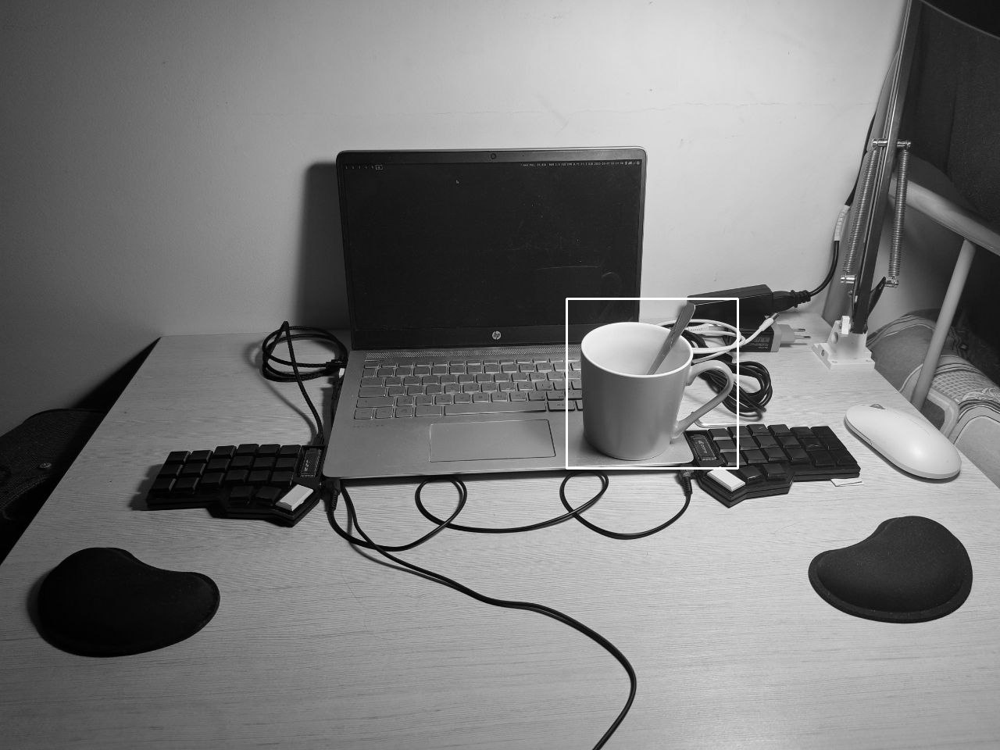
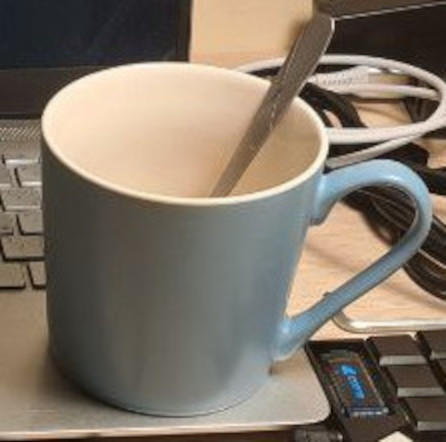 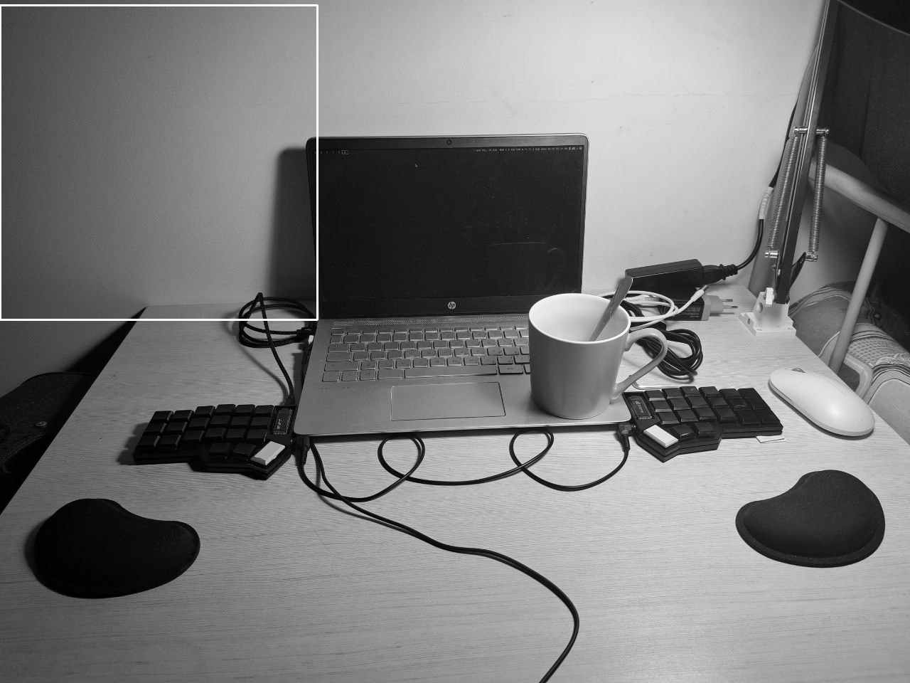 

### Временной анализ

Был проведен грубый временной анализ времени поиска. Результаты приведены в
файле `timings`. По результатам данного файла построен график приведенный ниже:
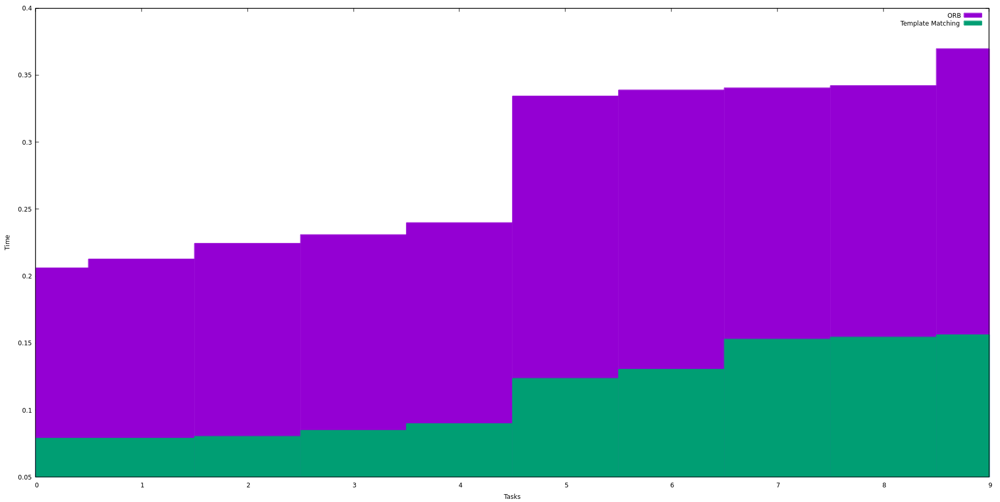

Как можно видеть, задача прямого поиска занимает меньше процессорного времени.

## Заключение

В ходе работы были изучены 2 алгоритма поиска шаблона на изображении. Алгоритм
показал себя хорошо в задачах, где шаблон являлся частью изображения. Во всех
остальных случаях алгоритм не справился задачей.

Алгоритм ORB показал себя значительно лучше в задачах, когда искомый обьект на
шаблоне масштабирован или повернут относительно обьекта на исходном изображении.

Алгоритм прямого поиска справился с 2 задачами из 10. Алгоритм ORB справился с 7
задачами и условно справился с 2 задачами из 10.
